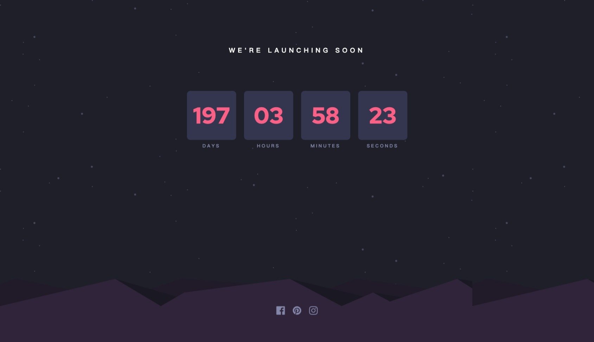

# Launch Countdown Timer

Responsive countdown timer for tracking time until a future launch date. The page updates dynamically every second to reflect days, hours, minutes, and seconds remaining.

## 🌐 Live Demo  
[👉 View Online](https://vanta-zjm.github.io/launch-countdown-timer/)

## 📸 Preview  

## 🛠️ Built With
- HTML5
- CSS3 (Grid & Flexbox)
- JavaScript (interval timer, date parsing)

## ✨ Key Features
- ✅ Real-time countdown display (updates every second)
- ✅ Handles past-date and zero-case scenarios
- ✅ Clean, centered layout with mobile responsiveness
- ✅ Styled number blocks with animated transitions

## 💡 What I Learned
- Using `setInterval()` for dynamic UI updates
- Handling and formatting time differences
- Responsive layout design for time-based interfaces

## 📄 License  
MIT
